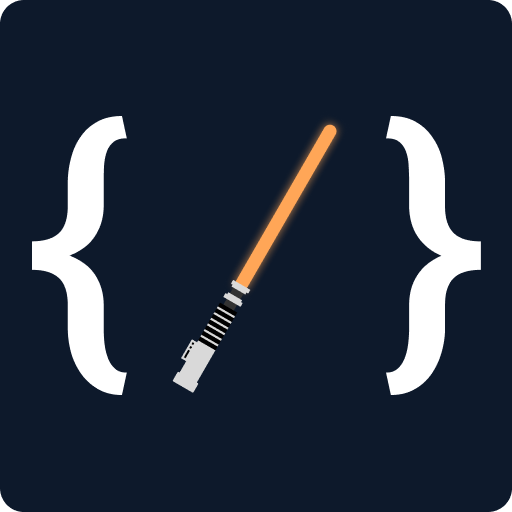

  

  
  
  
  
  <h1>Hello, fellow humans 🖖</h1>

  <picture>
    <source 
      srcset="https://streak-stats.demolab.com?user=lucasricci&theme=github-dark&hide_border=true"
      media="(prefers-color-scheme: dark)"
    />
    <source
      srcset="https://streak-stats.demolab.com?user=lucasricci&theme=github-light&hide_border=true"
      media="(prefers-color-scheme: light), (prefers-color-scheme: no-preference)"
    />
    
  </picture>

  <picture>
    <source 
      srcset="https://github-readme-stats.vercel.app/api/top-langs/?username=lucasricci&show_icons=true&theme=github_dark&include_all_commits&hide_border=true&layout=compact"
      media="(prefers-color-scheme: dark)"
    />
    <source
      srcset="https://github-readme-stats.vercel.app/api/top-langs/?username=lucasricci&show_icons=true&hide_border=true&include_all_commits=true&layout=compact"
      media="(prefers-color-scheme: light), (prefers-color-scheme: no-preference)"
    />
    
  </picture>

